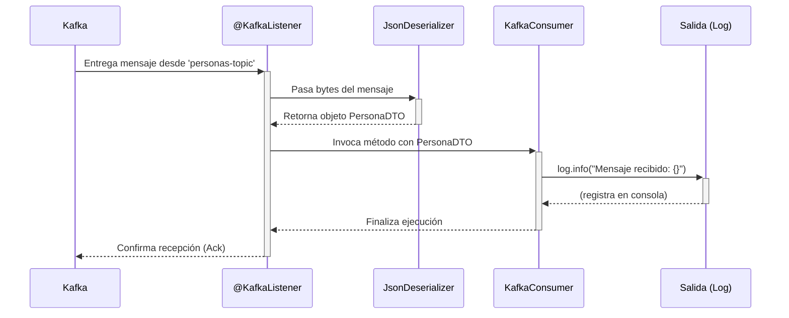

# Flujo Funcional: Consumidor de Personas

Este documento describe el flujo de datos interno del microservicio `persona-consumer-scaffold`. El proceso se inicia cuando un mensaje es consumido desde un tópico de Apache Kafka y finaliza con el procesamiento de dicho mensaje.

## Diagrama de Secuencia del Flujo

## Descripción Detallada del Flujo

1.  **Inicio (Consumo del Mensaje):** La aplicación está en ejecución y conectada a Apache Kafka. El `ConcurrentKafkaListenerContainerFactory` gestiona un listener que está activamente esperando mensajes en el tópico `personas-topic`.

2.  **Recepción y Deserialización:**
    *   Cuando un nuevo mensaje llega al tópico, el bróker de Kafka lo entrega al listener del consumidor.
    *   Spring Kafka intercepta los bytes del mensaje. Basado en la configuración del `ConsumerFactory` en `KafkaConfig.java`, utiliza un `StringDeserializer` para la clave y un `JsonDeserializer` para el valor.
    *   El `JsonDeserializer` toma los bytes del valor, los interpreta como una cadena JSON, y los convierte en una instancia del objeto `co.com.bancolombia.kafka.consumer.dto.PersonaDTO`.

3.  **Invocación del Punto de Entrada (`entry-point`):**
    *   Una vez que el mensaje es deserializado exitosamente a un objeto `PersonaDTO`, el contenedor del listener invoca al método anotado con `@KafkaListener` dentro de la clase `KafkaConsumer.java`.
    - Le pasa el objeto `PersonaDTO` ya construido como argumento al método.

4.  **Procesamiento del Mensaje:**
    *   El método `escucharMensajesDePersonas` se ejecuta.
    *   La lógica actual es simple: utiliza `Slf4j` para escribir el contenido del `PersonaDTO` recibido en el log de la aplicación con nivel `INFO`.
    *   **Nota:** En una aplicación más compleja, este sería el punto para invocar a un caso de uso del dominio (ej. `miCasoDeUso.procesar(persona)`) para aplicar la lógica de negocio real.

5.  **Confirmación (Acknowledgement):**
    *   Al finalizar la ejecución del método del listener sin que se produzca ninguna excepción, Spring Kafka automáticamente envía una confirmación (ack) de vuelta al bróker de Kafka.
    *   Esta confirmación le informa a Kafka que el mensaje ha sido procesado satisfactoriamente por este grupo de consumidores (`personas-group`), y Kafka puede proceder a avanzar el offset para no volver a entregar este mensaje al mismo grupo.
    *   Si ocurriera un error (una excepción), no se enviaría el ack. Dependiendo de la configuración de reintentos y DLT (Dead Letter Topic), Spring podría intentar procesar el mensaje de nuevo o enviarlo a un tópico de mensajes fallidos. 