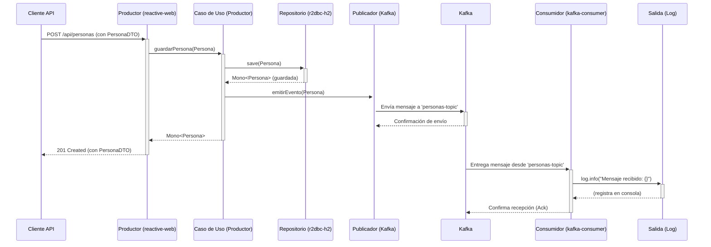

# Flujo Funcional Completo: Productor y Consumidor de Personas

Este documento describe el flujo de datos de extremo a extremo a través de los microservicios `persona-producer-scaffold` y `persona-consumer-scaffold`. El proceso se inicia con una solicitud para crear una nueva "Persona" y finaliza con el procesamiento del evento correspondiente.

## Diagrama de Secuencia del Flujo

## Descripción Detallada de los Endpoints

A continuación, se detalla el propósito y flujo de cada endpoint expuesto por el `persona-producer-scaffold`.

### `POST /api/personas` - Crear una Nueva Persona

Este endpoint se utiliza para registrar una nueva persona en el sistema. Es la operación más compleja ya que desencadena tanto la escritura en la base de datos como la publicación de un evento en Kafka.

- **Flujo Detallado:**
    1.  **Petición:** El cliente envía una petición `POST` con un objeto JSON `PersonaDTO` en el cuerpo.
    2.  **Handler:** `ApiHandler.crearPersona` recibe la petición, la mapea a una entidad de dominio `Persona`.
    3.  **UseCase:** Invoca a `PersonaUseCase.guardarPersona`.
    4.  **Orquestación:** El caso de uso llama a `PersonaRepository.save()` para persistir la entidad en la base de datos H2.
    5.  **Evento:** Inmediatamente después, el caso de uso llama a `PersonaEventsGateway.emitirEvento()` para publicar la nueva `Persona` en el tópico `personas-topic` de Kafka.
    6.  **Respuesta:** Se devuelve un `HTTP 201 Created` con la persona creada.

---

### `GET /api/personas` - Obtener Todas las Personas

Este endpoint recupera una lista de todas las personas registradas en la base de datos.

- **Flujo Detallado:**
    1.  **Petición:** El cliente envía una petición `GET`.
    2.  **Handler:** `ApiHandler.obtenerTodasLasPersonas` recibe la petición.
    3.  **UseCase:** Invoca a `PersonaUseCase.obtenerTodasLasPersonas`.
    4.  **Orquestación:** El caso de uso llama a `PersonaRepository.findAll()`.
    5.  **Persistencia:** `PersonaRepositoryImpl` ejecuta una consulta a la base de datos H2 para obtener todos los registros de la tabla de personas.
    6.  **Respuesta:** Se devuelve un `HTTP 200 OK` con un `Flux<PersonaDTO>`, que es un stream de todas las personas encontradas, mapeadas a su DTO.

---

### `GET /api/personas/{id}` - Obtener una Persona por ID

Este endpoint recupera una persona específica basada en su identificador único.

- **Flujo Detallado:**
    1.  **Petición:** El cliente envía una petición `GET` incluyendo el `id` en la URL (ej. `/api/personas/123`).
    2.  **Handler:** `ApiHandler.obtenerPersonaPorId` extrae el `id` de la ruta.
    3.  **UseCase:** Invoca a `PersonaUseCase.obtenerPersonaPorId(id)`.
    4.  **Orquestación:** El caso de uso llama a `PersonaRepository.findById(id)`.
    5.  **Persistencia:** `PersonaRepositoryImpl` ejecuta una consulta a la base de datos H2 para encontrar el registro con el ID especificado.
    6.  **Respuesta:** Si se encuentra la persona, se devuelve un `HTTP 200 OK` con el `PersonaDTO` correspondiente. Si no se encuentra, se devuelve un `HTTP 404 Not Found`.

---

### `GET /api/event-stream` - Stream de Eventos en Tiempo Real

Este endpoint especial utiliza Server-Sent Events (SSE) para empujar un evento al cliente cada vez que se guarda una persona en la base de datos. Permite a los clientes recibir actualizaciones en tiempo real sin necesidad de polling.

- **Flujo Detallado:**
    1.  **Petición:** Un cliente (normalmente un navegador web) establece una conexión `GET` a este endpoint con la cabecera `Accept: text/event-stream`.
    2.  **Handler:** `ApiHandler.streamPersonas` maneja la conexión.
    3.  **UseCase:** Invoca a `PersonaUseCase.obtenerEventosDePersonas()`.
    4.  **Orquestación:** A diferencia de otros flujos, este caso de uso no interactúa con un `gateway` que va a una base de datos. En su lugar, se conecta a un `Flux` (un stream de datos reactivo) que es alimentado por los mismos eventos que se publican internamente tras una operación de guardado.
    5.  **Respuesta:** Se establece una conexión HTTP persistente. Cada vez que el `Flux` interno emite un nuevo objeto `Persona`, el `Handler` lo envuelve en un `ServerSentEvent` y lo escribe en el flujo de respuesta hacia el cliente. La conexión permanece abierta, enviando nuevos eventos a medida que ocurren.

## Descripción Detallada del Flujo

### Parte 1: El Productor (`persona-producer-scaffold`)

1.  **Inicio (Petición del Cliente):** Un sistema externo (o un usuario a través de una herramienta como Postman) envía una petición `POST` al endpoint `/api/personas` del servicio productor. El cuerpo de la petición contiene un objeto JSON que representa a la persona que se desea crear (ej: `{"nombre": "Ana", "apellido": "García", "edad": 30}`).

2.  **Punto de Entrada (`reactive-web`):**
    *   El `ApiRouter` de Spring WebFlux recibe la petición y la dirige al `ApiHandler`.
    *   El `ApiHandler` deserializa el JSON del cuerpo a un objeto `PersonaDTO`.
    *   Utiliza un `PersonaMapper` para convertir el `PersonaDTO` (un objeto de transferencia) a una entidad `Persona` (el objeto del dominio de negocio).

3.  **Lógica de Negocio (`usecase`):**
    *   El `ApiHandler` invoca al método `guardarPersona` en la clase `PersonaUseCase`, pasándole la entidad `Persona`.
    *   El `PersonaUseCase` orquesta la operación:
        a. Primero, llama al método `save()` de la interfaz `PersonaRepository` (un gateway de persistencia).
        b. Una vez que la operación de guardado se completa de forma reactiva, llama al método `emitirEvento()` de la interfaz `PersonaEventsGateway` (un gateway de eventos).

4.  **Adaptadores de Infraestructura (`driven-adapters`):**
    *   **Persistencia (`r2dbc-h2`):** La implementación `PersonaRepositoryImpl` recibe la llamada. Mapea la entidad `Persona` a una entidad `PersonaData` y la guarda en la base de datos en memoria H2 usando R2DBC.
    *   **Publicación de Eventos (`async-event-bus`):** La implementación `KafkaEventPublisher` recibe la llamada. Usa el `KafkaTemplate` de Spring para serializar la entidad `Persona` a JSON y la envía como un mensaje al tópico `personas-topic` en Apache Kafka.

5.  **Respuesta al Cliente:** El flujo reactivo se completa y el `ApiHandler` devuelve una respuesta `HTTP 201 Created` al cliente, usualmente con el DTO de la persona recién creada, incluyendo el ID asignado por la base de datos.

### Parte 2: El Consumidor (`persona-consumer-scaffold`)

6.  **Entrega del Mensaje (Kafka):** El bróker de Kafka, al tener un nuevo mensaje en `personas-topic`, lo entrega a todos los grupos de consumidores suscritos.

7.  **Recepción del Mensaje (`kafka-consumer`):**
    *   La clase `KafkaConsumer` está escuchando activamente el tópico `personas-topic` gracias a la anotación `@KafkaListener`.
    *   El `ConsumerFactory` configurado en `KafkaConfig` utiliza un `JsonDeserializer` para convertir el JSON del mensaje de Kafka directamente en un objeto `PersonaDTO`.

8.  **Procesamiento del Mensaje:**
    *   El método `escucharMensajesDePersonas` en `KafkaConsumer` se invoca automáticamente con el `PersonaDTO` ya deserializado como argumento.
    *   En la implementación actual, la lógica de procesamiento es simple: se imprime el contenido del `PersonaDTO` en la consola de la aplicación usando `log.info()`.
    *   En un escenario real, este método invocaría a un `UseCase` del lado del consumidor para realizar acciones más complejas (ej: guardar en otra base de datos, notificar a otro sistema, etc.).

9.  **Confirmación (Acknowledgement):** Una vez que el método del listener se ejecuta sin lanzar excepciones, el consumidor envía una confirmación (ack) a Kafka, indicando que el mensaje ha sido procesado correctamente. Kafka entonces marca ese mensaje como consumido para ese `group-id`. 